# Lazy DEK Replication & P2P Discovery

A decentralized key management architecture for encrypted content distribution using OpenTDF/NanoTDF.

## Overview

Traditional encrypted file systems require users to pre-distribute encryption keys to all parties who might need access. This design flips that model:

- **Publisher uploads once** to a single validator
- **DEKs replicate lazily** across the network based on policy
- **Decryption is load-balanced** across any validator holding the DEK
- **Users discover DEK holders** via P2P queries

## Architecture

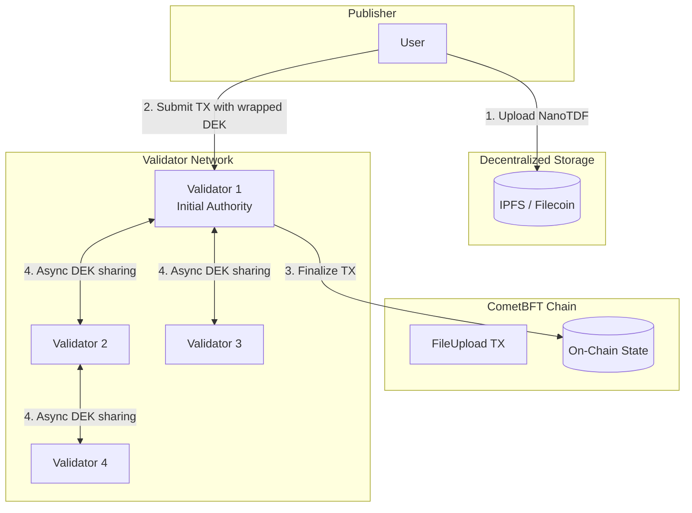

## Upload Flow

When a user uploads encrypted content, they only interact with a single validator.

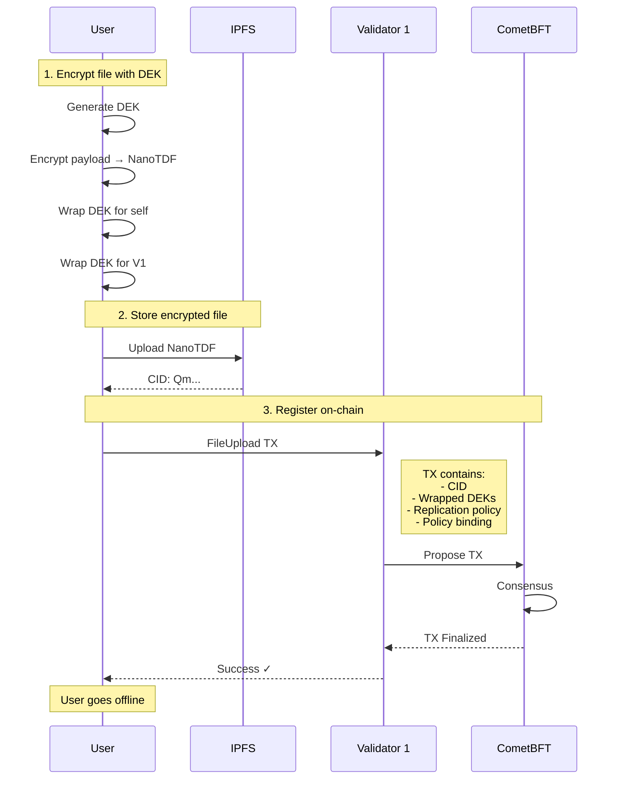

## Lazy DEK Replication

After the upload TX is finalized, validators asynchronously replicate the DEK based on the replication policy.

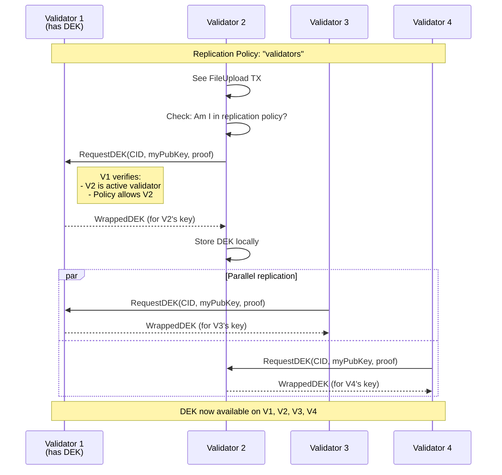

## DEK Discovery & Decryption

When a user needs to decrypt, they query the network to find any validator holding the DEK.

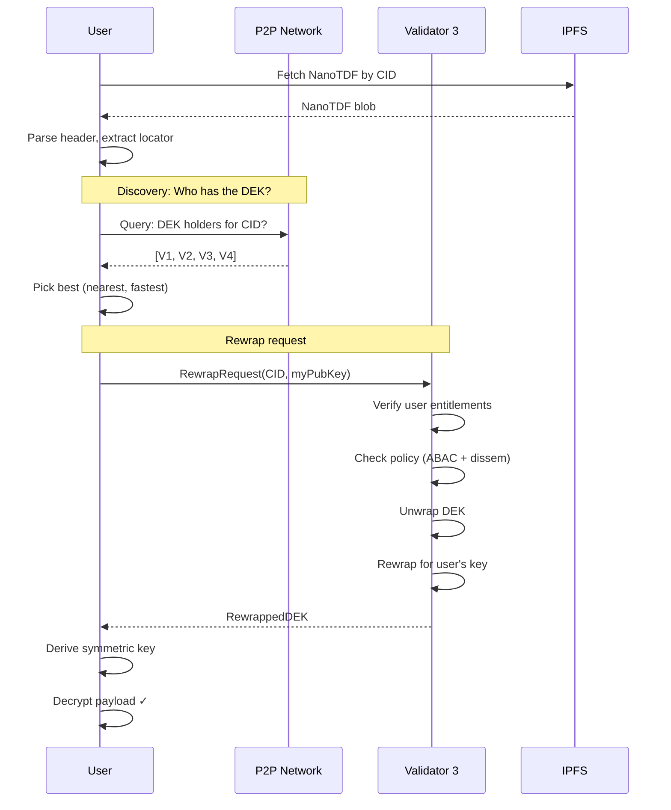

## Replication Policies

Publishers control how their DEKs propagate through the network.

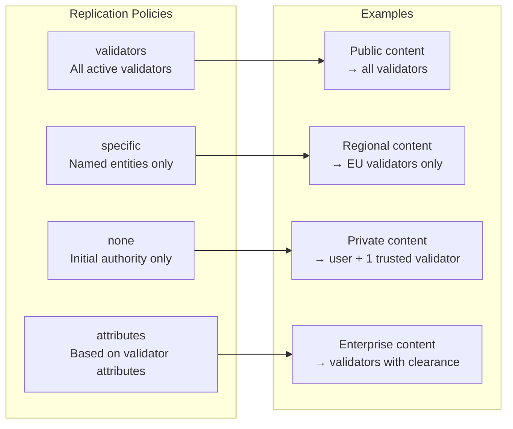

## On-Chain State

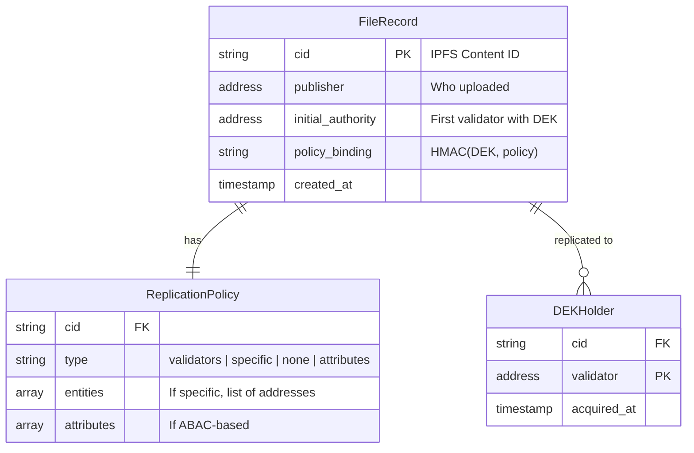

## Forward-If-Not-Have Pattern

Any validator can handle decrypt requests, forwarding if they don't have the DEK.

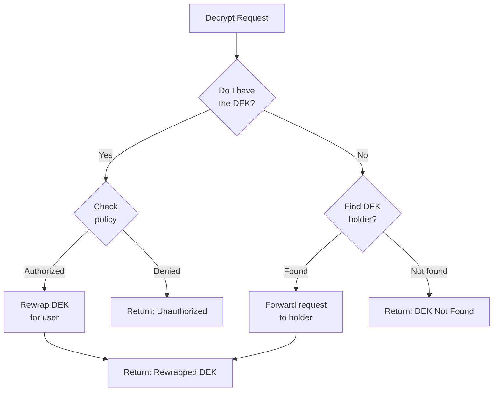

## Validator Departure

When a validator leaves the active set, they naturally lose the ability to service requests.

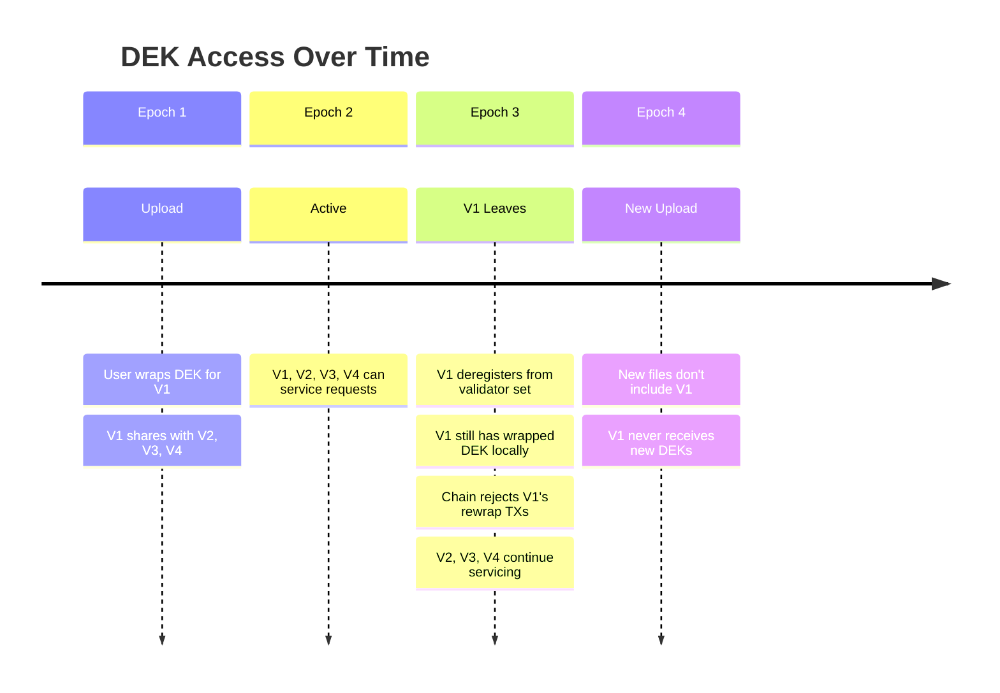

## Security Properties

| Property | Guarantee |
|----------|-----------|
| **Publisher control** | Only publisher decides initial DEK distribution |
| **Policy enforcement** | All rewrap requests validate ABAC policy |
| **Validator accountability** | Rewrap TXs are on-chain, auditable |
| **Departed validator exclusion** | Chain rejects non-active validators |
| **No single point of failure** | Any DEK holder can service requests |
| **Lazy replication** | DEKs spread on-demand, not upfront |

## Client Interface

From the user's perspective, complexity is hidden:

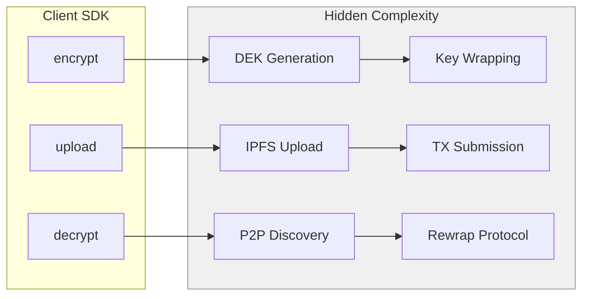

```go
// Simple client API
client := opentdf.NewClient(chainConfig)

// Upload (handles DEK, wrapping, IPFS, TX)
cid, err := client.Upload(fileBytes, Policy{
    Attributes: []string{"clearance/secret"},
    Replication: "validators",
})

// Decrypt (handles discovery, rewrap, decryption)
plaintext, err := client.Decrypt(cid)
```

## Comparison: Traditional vs Lazy Replication

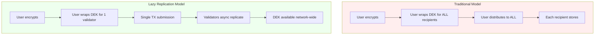

| Aspect | Traditional | Lazy Replication |
|--------|-------------|------------------|
| User effort | High (wrap for all) | Low (wrap for one) |
| Network calls | O(n) recipients | O(1) validator |
| DEK availability | Immediate | Eventually consistent |
| Publisher online time | Until all distributed | Until TX confirmed |
| Validator coordination | None | P2P DEK sharing |

## Implementation Notes

### NanoTDF for Storage Efficiency

NanoTDF is ideal for this architecture:

- **Compact**: < 200 bytes overhead
- **Self-contained**: Header includes locator and policy
- **ECC-based**: Compatible with blockchain cryptography
- **Single blob**: One CID per file, no manifest separation

### Key Derivation Flow

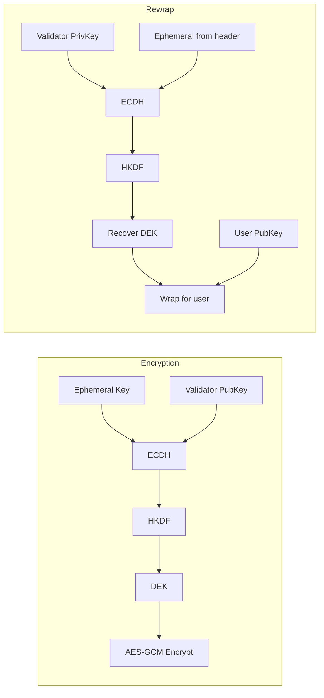

## Summary

This architecture achieves:

1. **Minimal publisher burden** — Upload to one validator, done
2. **Network-level key distribution** — Validators handle replication
3. **Resilient decryption** — Any validator with DEK can serve
4. **Publisher-defined policies** — Full control over who gets access
5. **Natural validator churn handling** — Departed validators excluded automatically
6. **Auditable access** — All rewraps are on-chain transactions
7. **Decentralized storage** — Encrypted files on IPFS, keys managed by validators

